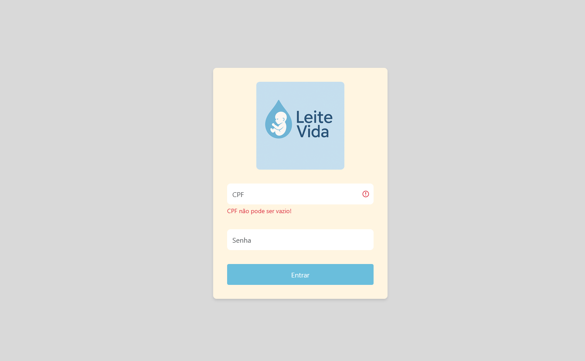
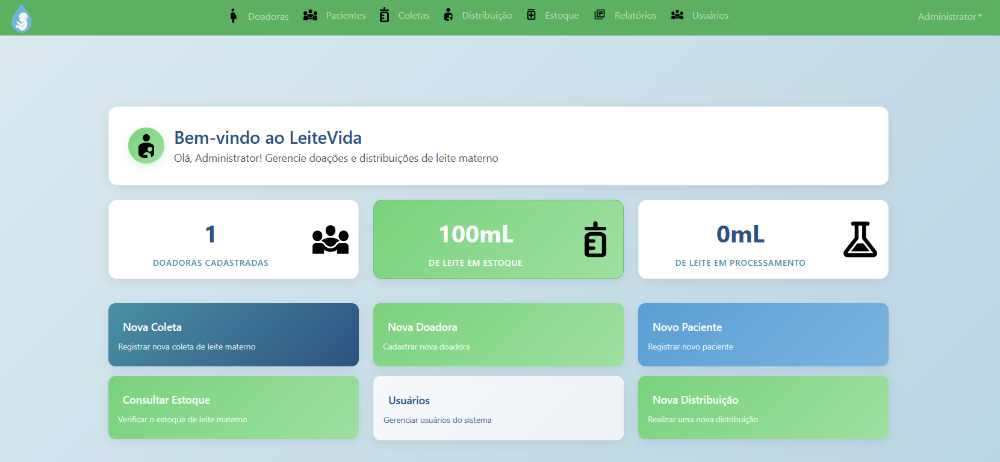
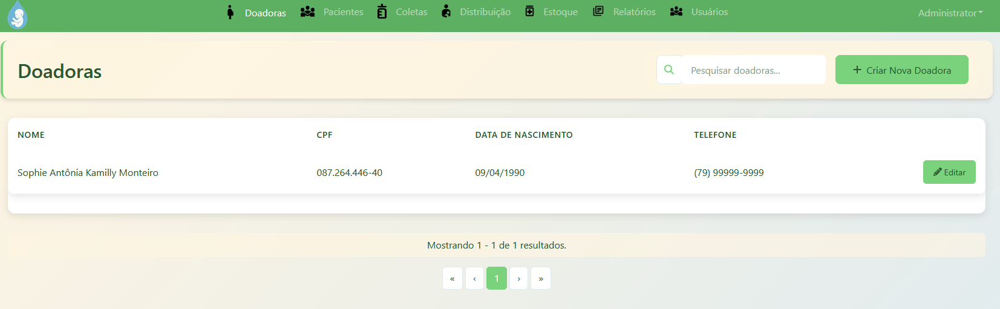
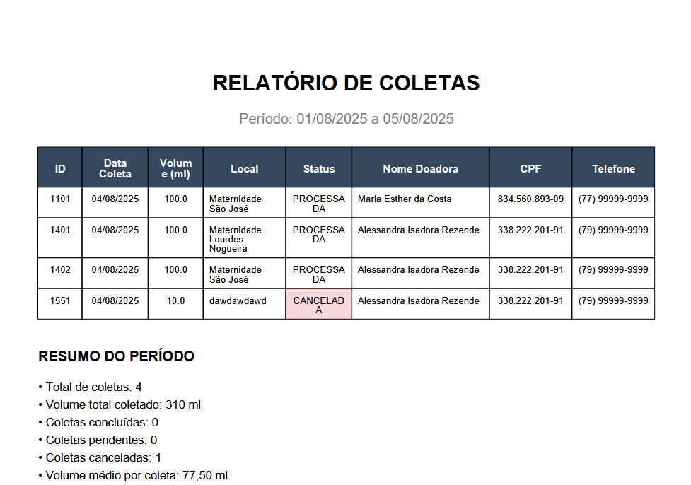

# LeiteVida - Sistema de Gerenciamento para Banco de Leite Humano


## 📋 Sobre o Projeto

LeiteVida é um sistema web desenvolvido para otimizar e gerenciar todos os processos operacionais de um Banco de Leite Humano (BLH). O sistema facilita o cadastro e acompanhamento de doadoras, o registro de coletas de leite materno, o controle de estoque e a distribuição do leite processado para pacientes neonatais.

### Principais funcionalidades:

- Cadastro e gerenciamento de doadoras
- Registro e rastreamento de coletas de leite materno
- Processamento e análise laboratorial das amostras
- Controle de estoque e validade dos lotes
- Gerenciamento de distribuição aos pacientes
- Geração de relatórios e estatísticas
- Controle de acesso por perfis de usuário

## 🚀 Tecnologias Utilizadas

- **Frontend**:

  - React/TypeScript
  - React Router DOM
  - Reactstrap (Bootstrap para React)
  - SCSS para estilos personalizados
  - FontAwesome para ícones
  - Axios para requisições HTTP

- **Backend**:
  - Spring Boot
  - Spring Security
  - JPA/Hibernate
  - Banco de dados relacional
  - RESTful API

## 📦 Estrutura do Projeto

O projeto segue uma arquitetura moderna de aplicação web com separação clara entre frontend e backend:

```
leite-vida/
│
├── src/main/
│   ├── java/           # Código backend Java/Spring Boot
│   ├── resources/      # Recursos para o backend
│   └── webapp/         # Aplicação frontend React
│       ├── app/        # Componentes React
│       │   ├── config/         # Configurações
│       │   ├── modules/        # Módulos da aplicação
│       │   │   ├── home/       # Página inicial
│       │   │   ├── doadora/    # Gerenciamento de doadoras
│       │   │   ├── coleta/     # Gestão de coletas
│       │   │   ├── estoque/    # Controle de estoque
│       │   │   └── administration/ # Funções administrativas
│       │   └── shared/         # Componentes compartilhados
│       ├── content/    # Recursos estáticos (imagens, etc.)
│       └── scss/       # Estilos globais
│
├── config/             # Configurações do projeto
├── node_modules/       # Dependências Node.js
└── package.json        # Definição de pacotes e scripts
```

## 🔧 Instalação e Execução

### Pré-requisitos

- Node.js (v14+)
- Java JDK 11+
- Maven 3.6+
- Banco de dados compatível (PostgreSQL recomendado)

### Passos para execução

1. Clone o repositório:

   ```bash
   git clone https://github.com/sua-organizacao/leite-vida.git
   cd leite-vida
   ```

2. Instale as dependências do frontend:

   ```bash
   npm install
   ```

3. Configure o banco de dados em `application.yml` ou através de variáveis de ambiente.

4. Execute o backend:

   ```bash
   ./mvnw spring-boot:run
   ```

5. Em outro terminal, execute o frontend:

   ```bash
   npm start
   ```

6. Acesse a aplicação em [http://localhost:8080](http://localhost:8080)

7. Configure suas credenciais do banco de dados (PostgreSQL) em application-dev

## 👤 Perfis de Usuário

O sistema oferece diferentes perfis de acesso:

1. **Administrador**: Acesso completo a todas as funcionalidades, incluindo gerenciamento de usuários.
2. **Operador**: Pode registrar doadoras, coletas e distribuições.
3. **Laboratório**: Responsável pelas análises e processamento do leite.
4. **Consulta**: Acesso apenas para visualização de dados, sem permissão de alteração.

## 📱 Interface do Sistema

### Tela de Login



A tela de login apresenta uma interface limpa e intuitiva com o logotipo do LeiteVida. Os usuários devem inserir seu CPF e senha para acessar o sistema.

### Home Page



O dashboard principal mostra estatísticas importantes:

- Número de doadoras cadastradas
- Volume de leite em estoque
- Volume de leite em processamento

Também apresenta acesso rápido às principais funcionalidades através de botões de ação.

### Listagem de Doadoras



Interface para visualização e gerenciamento de doadoras cadastradas, com opções para filtrar, editar e adicionar novas doadoras.

### Relatórios



O sistema permite gerar relatórios detalhados sobre coletas, processamento e distribuição, com filtros por período e possibilidade de exportação.

## 🔒 Segurança

- Autenticação por login e senha
- Controle de sessão
- Validação de permissões por rota
- Criptografia de dados sensíveis
- Proteção contra CSRF e XSS

## 📊 Funcionalidades de Relatórios

O sistema oferece diversos relatórios para acompanhamento e gestão:

- Relatório de doadoras ativas
- Relatório de coletas por período
- Relatório de estoque (volume disponível e validade)
- Relatório de distribuição (volume distribuído por paciente/hospital)
- Estatísticas de produção e distribuição
